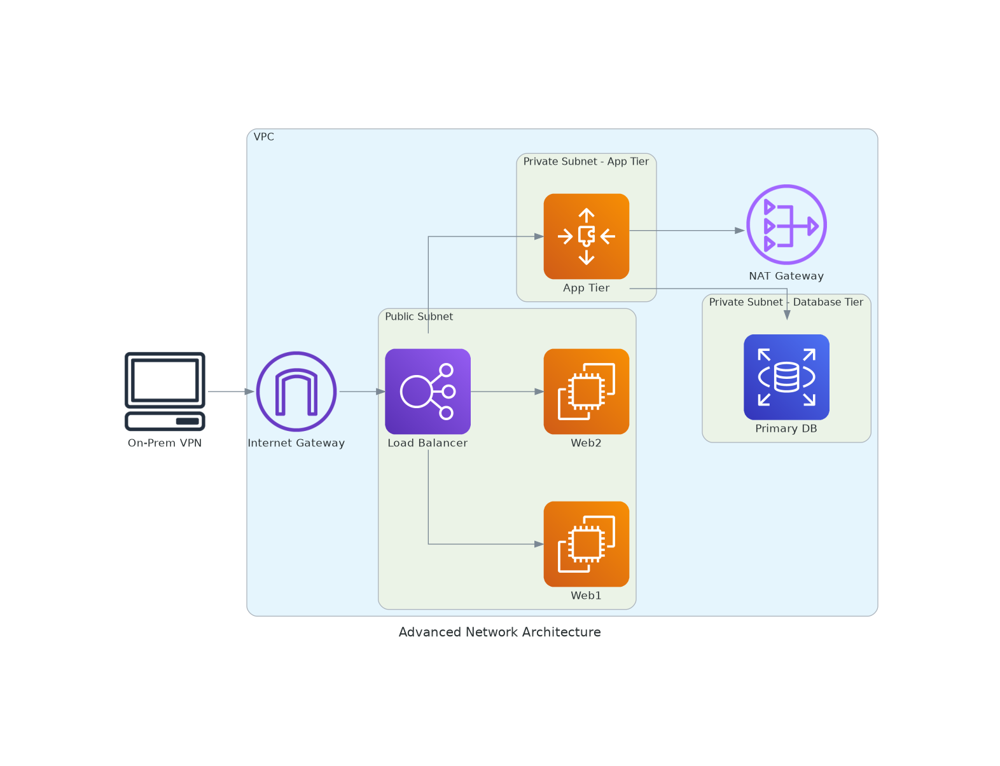

# 🌐 NetArch-AutoGen – CI/CD-Based Network Diagram Generator

**NetArch-AutoGen** is a GitHub Actions–powered tool that auto-generates professional **network architecture diagrams** using Python and [Diagrams by Mingrammer](https://diagrams.mingrammer.com/). Designed with Infrastructure-as-Code principles, it enables seamless, repeatable diagram generation as part of your CI/CD pipeline.

---

## 🔧 Features

- 🔁 **CI/CD Integration** – Automatically generates diagrams via GitHub Actions on demand or push
- 📐 **Infrastructure as Code** – Define your architecture logically using Python
- 📤 **Downloadable Artifacts** – Output diagrams saved as PNGs and attached to each CI run
- 🌐 **Supports Hybrid Topologies** – Visualize public/private subnets, multiple tiers, and on-prem components

---

## 📌 Sample Output

---
## 🚀 How It Works

1. Add a new YAML or JSON file under the `configs/` folder.
2. Push your changes to GitHub.
3. GitHub Actions will automatically:
   - Run your Python script
   - Generate a network diagram (PNG)
   - Commit it to the `outputs/` folder

No manual effort required!
