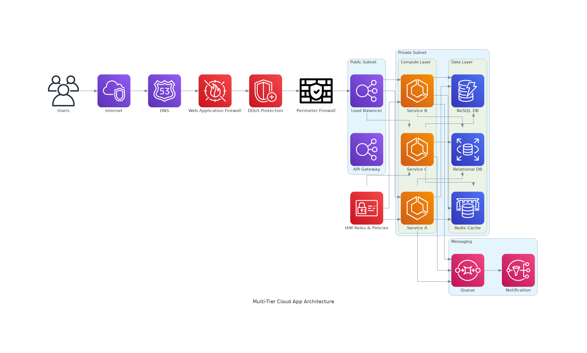

[](https://github.com/ird1natris/NetArch-AutoGen/actions)
[](https://www.python.org/)

# NetArch‑AutoGen 🏗️

**Automate your network architecture diagramming** with ease — transform simple YAML/JSON configs into professional, standardized visuals. Perfect for cloud architects, network engineers, and security teams looking to streamline documentation and communication.

---

## 🌟 Highlights

- 🛠️ **Config-Driven Diagrams:** Define your infrastructure declaratively using YAML/JSON.
- 🌐 **Multi-Architecture Ready:** Support for cloud, on-prem, multi-tier, banking, zero-trust, and more.
- ⚙️ **GitHub Actions CI/CD:** Automatically generate, commit, and update diagram images on repo changes.
- 💻 **Clean CLI Interface:** `src/cli.py` offers simple, reusable commands for local or automated use.
- 📦 **Artifact Management:** Easily upload, download, or share generated PNG diagrams.

---

## 🚀 Quick Start Guide

### 1. Clone & Setup Dependencies
```bash
git clone https://github.com/ird1natris/NetArch-AutoGen.git
cd NetArch‑AutoGen
pip install -r requirements.txt
sudo apt-get install graphviz
```
### 2. Generate Your First Diagram Locally
```bash
python src/cli.py --config configs/sample_config.yaml --output outputs/sample_config.png

# Then open the output:
open outputs/sample_config.png  # macOS
# or
xdg-open outputs/sample_config.png  # Linux
```
### 3. Automate Diagram Generation via GitHub Actions
- Push updates to configs/ or src/
- GitHub Actions runs automatically (triggered by diagram.yml)
- Generated diagrams saved & committed to outputs/
- Monitor progress via Actions tab

---

## 🗂️ Project Structure
```bash
NetArch‑AutoGen/
├─ configs/                  # YAML/JSON infrastructure definitions
├─ diagrams/                 # Diagram scripts for various architectures
│  ├─ diagram_generator.py
│  └─ multi_tier_cloud_app.py
├─ outputs/                  # Generated diagram PNG files
├─ src/                     # Core logic & CLI interface
│  ├─ cli.py
│  ├─ config_parser.py
│  └─ diagram_generator.py
├─ tests/                   # Unit tests for core modules
│  └─ test_config_parser.py
├─ .github/workflows/        # CI/CD pipeline definitions
│  ├─ diagram.yml
│  ├─ github-actions-demo.yml
│  └─ list_nodes.yml
├─ .gitignore
├─ LICENSE
├─ requirements.txt
└─ README.md
```
---

## 📊 Sample Output

Here is a sample network architecture diagram generated by NetArch-AutoGen:



---

## 🛠️ Roadmap

| Feature                          | Status       |
|---------------------------------|--------------|
| ✅ **CLI-driven diagram generation** | Completed ✅ |
| ✅ **Multi-tier & config diagrams**  | Completed ✅ |
| ✅ **GitHub Actions automation**     | Completed ✅ |
| 🔜 **Streamlit / Flask UI**          | Coming Soon ⏳ |
| 🔜 **SVG/HTML export**               | Coming Soon ⏳ |
| 🔜 **Zero-Trust diagram support**    | Planned 📅    |
| 🔜 **Slack/MS Teams notifications**  | Planned 📅    |

---

## 🎓 Use Cases

NetArch‑AutoGen is ideal for:

- ☁️ **Cloud Architects**  
  Quickly draft and visualize complex cloud infrastructures and VPC layouts.

- 🔌 **Network Engineers**  
  Document and communicate network topologies with clear, standardized diagrams.

- 🛡️ **Security Teams**  
  Visualize segmentation, firewall rules, and zero-trust architectures for audits.

- 🎓 **Consultants & Academics**  
  Present detailed, customizable network designs for clients, training, or research.

---

## ✨ Why It Matters

- ⏳ **Saves Time**  
  Automate tedious manual diagram creation and focus on designing solutions.

- 🎯 **Consistency & Accuracy**  
  Generate standardized diagrams directly from your config files — no guesswork.

- 🔄 **Infrastructure as Code**  
  Embed diagram generation into CI/CD pipelines for up-to-date documentation.

- 📈 **Better Communication**  
  Clear visuals help teams, stakeholders, and clients understand architectures quickly.

- 🌍 **Scalable & Extensible**  
  Easily add new architectures or customize existing ones to fit any environment.
